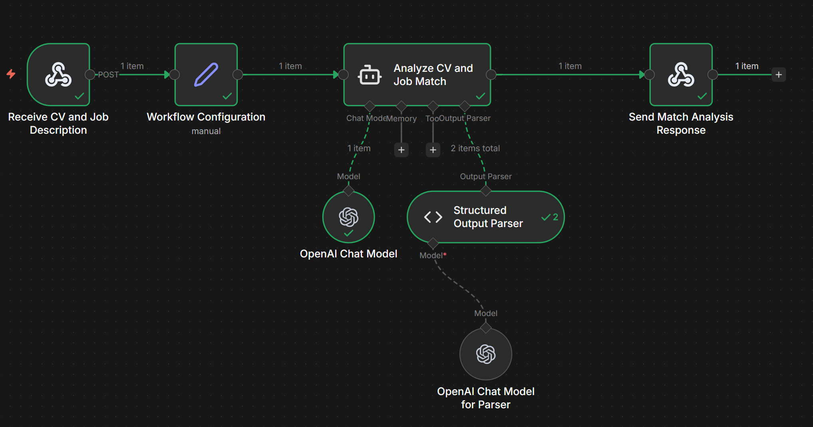

# Resume Match Analyzer

A modern web application that analyzes how well your resume matches a job description. Get instant insights on matching skills, missing skills, location compatibility, experience requirements, and actionable suggestions for improvement.

## Features

- **Resume & Job Description Analysis**: Paste your resume and job description to get a comprehensive match analysis
- **Match Score**: Visual score badge showing overall compatibility (0-100)
- **Matching Skills**: See which skills from your resume align with the job requirements
- **Missing Skills**: Identify gaps in your skill set compared to the job posting
- **Location Comparison**: Compare resume location with job location and see if they match
- **Experience Analysis**: Compare your years of experience with the job requirements
- **Actionable Suggestions**: Get specific recommendations to improve your resume
- **Responsive Design**: Fully optimized for desktop, tablet, and mobile devices
- **Modern UI**: Beautiful dark theme with smooth animations and intuitive interface

## Tech Stack

- **React 19** - UI library
- **TypeScript** - Type-safe JavaScript
- **Webpack 5** - Module bundler
- **CSS Modules** - Scoped styling
- **n8n** - Backend workflow automation (via webhook)

## Workflow Structure
Webhook Trigger → Data Extraction → AI Agent (OpenAI) → Response Formatting → Webhook Response

## Components:

* Webhook Trigger - Receives POST requests with resume and job description data
* Workflow Configuration - Extracts and normalizes input data
* AI Agent - Analyzes CV match using OpenAI with structured output parsing
* Response Handler - Returns formatted analysis results



## Getting Started

### Prerequisites

- Node.js 18.12.0 or higher
- npm or yarn package manager

### Installation

1. Clone the repository:
```bash
git clone <repository-url>
cd cv-match
```

2. Install dependencies:
```bash
npm install
```

3. Configure the n8n webhook URL:
   - Update `N8N_ANALYZE_URL` with your n8n webhook endpoint

### Development

Start the development server:
```bash
npm run dev
```

The application will open at `http://localhost:8080` with hot module replacement enabled.

### Building for Production

Create a production build:
```bash
npm run build
```

The optimized bundle will be output to the `dist/` directory.

## Usage

1. **Start Analysis**: On the home page, paste your resume text in the left field and the job description in the right field
2. **Analyze**: Click "Analyze match" to send both texts for AI analysis
3. **View Results**: 
   - See your match score in the prominent badge
   - Review matching skills (highlighted in green)
   - Check missing or weak skills (highlighted in red)
   - Compare location and experience requirements
   - Read actionable suggestions for improvement
4. **Review Content**: Scroll down to see the resume and job description you submitted
5. **Next Position**: Click "Analyze next position" to start a new analysis

## API Integration

The application integrates with n8n workflows via webhook. The expected request format:

```typescript
{
  resumeText: string;
  jobDescription: string;
}
```

Expected response format:
```typescript
[
  {
    output: {
      matchScore: number;
      matchingSkills: string[];
      missingSkills: string[];
      locationComparison: {
        resumeLocation: string;
        jobLocation: string;
        isMatch: boolean;
        notes: string;
      };
      experienceComparison: {
        resumeYears: number;
        requiredYears: number;
        meetsRequirement: boolean;
        notes: string;
      };
      suggestions: string[];
    }
  }
]
```

## Styling

The project uses **CSS Modules** for component-scoped styling:
- Files ending in `.module.css` are treated as CSS Modules
- Import styles: `import styles from './Component.module.css'`
- Use classes: `className={styles.className}`
- Global styles are in `src/styles/global.css`

## Browser Support

- Chrome (latest)
- Firefox (latest)
- Safari (latest)
- Edge (latest)
- Mobile browsers (iOS Safari, Chrome Mobile)

## Demo URL
https://cv-match-1-n6uu.onrender.com/

