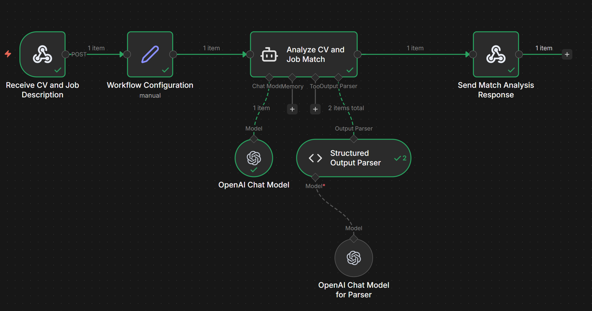

# Resume Match Analyzer

A modern web application that analyzes how well your resume matches a job description. Get instant insights on matching skills, missing skills, location compatibility, experience requirements, and actionable suggestions for improvement.

**Updated version** includes **Google authentication** (optional sign-in or skip) and **per-user history** so you can revisit past analyses.

## Features

- **Resume & Job Description Analysis**: Paste your resume and job description to get a comprehensive match analysis
- **Match Score**: Visual score badge showing overall compatibility (0-100)
- **Matching Skills**: See which skills from your resume align with the job requirements
- **Missing Skills**: Identify gaps in your skill set compared to the job posting
- **Location Comparison**: Compare resume location with job location and see if they match
- **Experience Analysis**: Compare your years of experience with the job requirements
- **Actionable Suggestions**: Get specific recommendations to improve your resume
- **Google Sign-In (optional)**: Sign in with Google to save analyses to your personal history, or skip and use the app without an account
- **History**: View and reopen past analyses in a table; each signed-in user sees only their own history
- **Sign in / Log out**: Sign in from the header when you skipped initially, or log out to return to the welcome screen
- **Responsive Design**: Fully optimized for desktop, tablet, and mobile devices
- **Modern UI**: Beautiful dark theme with smooth animations and intuitive interface

## Tech Stack

- **React 19** - UI library
- **TypeScript** - Type-safe JavaScript
- **Webpack 5** - Module bundler
- **CSS Modules** - Scoped styling
- **Node.js + Express** - Backend server (API, request logging, proxy to n8n)
- **n8n** - Workflow automation (via webhook); the server proxies requests so the webhook URL stays server-side

## Backend (Server)

The app includes a **Node.js + Express** server that:

- **Serves the API**: `GET /api/health` (health check), `POST /api/analyze` (resume–job analysis), `GET /api/history` (list past analyses), and `GET /api/history/:id` (single analysis).
- **Proxies to n8n**: The frontend calls `/api/analyze`; the server forwards the request to your n8n webhook. The n8n URL is only in server environment variables, not in the browser.
- **History storage**: Saves each successful analysis to a per-user JSON file under `data/` when the user is signed in (Google). History is keyed by Google user ID so each user sees only their own results.
- **Request logging**: Logs method, path, status code, and duration for each request.
- **Serves the frontend in production**: When deployed, the same server serves the built React app from `dist/` and the API, so one service handles everything.

The server entry is `server.js`; in development you run it with `npm run server` (port 3001) alongside the frontend dev server (port 8080), or use `npm run dev:all` to run both.

## Workflow Structure
Webhook Trigger → Data Extraction → AI Agent (OpenAI) → Response Formatting → Webhook Response

## Components:

* Webhook Trigger - Receives POST requests with resume and job description data
* Workflow Configuration - Extracts and normalizes input data
* AI Agent - Analyzes CV match using OpenAI with structured output parsing
* Response Handler - Returns formatted analysis results



## Getting Started

### Prerequisites

- Node.js 18.12.0 or higher
- npm or yarn package manager

### Installation

1. Clone the repository:
```bash
git clone <repository-url>
cd cv-match
```

2. Install dependencies:
```bash
npm install
```

3. **Add a `.env` file** in the project root to run locally. You need this file for local development; the server and the frontend build read environment variables from it. Create `.env` in the project root (it is gitignored). Add at least:
   - **N8N_ANALYZE_URL** – your n8n webhook endpoint for resume analysis
   - **GOOGLE_CLIENT_ID** (optional) – Google OAuth 2.0 client ID for sign-in; if set, users can sign in with Google and get per-user history. Add `http://localhost:8080` (and your production URL) to **Authorized JavaScript origins** and **Authorized redirect URIs** in [Google Cloud Console](https://console.cloud.google.com/) → Credentials.

### Development

You need both the **frontend** and the **backend** running.

**Option 1 – one command (recommended):**
```bash
npm run dev:all
```
Starts the Express server (port 3001) and the Webpack dev server (port 8080). The app at `http://localhost:8080` proxies `/api` to the backend.

**Option 2 – two terminals:**
```bash
# Terminal 1 – backend
npm run server

# Terminal 2 – frontend
npm run dev
```
The application will open at `http://localhost:8080` with hot module replacement enabled.

### Building for Production

Create a production build:
```bash
npm run build
```

The optimized bundle will be output to the `dist/` directory.

## Usage

1. **Welcome screen**: Choose **Sign in with Google** (to save analyses to your history) or **Skip for now** to use the app without an account. You can sign in later from the header.
2. **Start Analysis**: On the home page, paste your resume text in the left field and the job description in the right field.
3. **Analyze**: Click "Analyze match" to send both texts for AI analysis. If you’re signed in, the result is saved to your history.
4. **View Results**:
   - See your match score in the prominent badge
   - Review matching skills (highlighted in green)
   - Check missing or weak skills (highlighted in red)
   - Compare location and experience requirements
   - Read actionable suggestions for improvement
5. **Review Content**: Scroll down to see the resume and job description you submitted.
6. **History**: Click **History** in the header to open a table of your past analyses (date, match score, snippets). Click **View** on a row to see the full result again.
7. **Sign in / Log out**: Use **Sign in** in the header when you skipped at first; use **Log out** to return to the welcome screen.
8. **Next Position**: Click "Analyze next position" to start a new analysis.

## API Integration

The **frontend** calls the **server** at `POST /api/analyze`; the **server** forwards the request to your **n8n** webhook. The expected request format:

```typescript
{
  resumeText: string;
  jobDescription: string;
}
```

Expected response format:
```typescript
[
  {
    output: {
      matchScore: number;
      matchingSkills: string[];
      missingSkills: string[];
      locationComparison: {
        resumeLocation: string;
        jobLocation: string;
        isMatch: boolean;
        notes: string;
      };
      experienceComparison: {
        resumeYears: number;
        requiredYears: number;
        meetsRequirement: boolean;
        notes: string;
      };
      suggestions: string[];
    }
  }
]
```

## Styling

The project uses **CSS Modules** for component-scoped styling:
- Files ending in `.module.css` are treated as CSS Modules
- Import styles: `import styles from './Component.module.css'`
- Use classes: `className={styles.className}`
- Global styles are in `src/styles/global.css`

## Browser Support

- Chrome (latest)
- Firefox (latest)
- Safari (latest)
- Edge (latest)
- Mobile browsers (iOS Safari, Chrome Mobile)

## Demo URL
https://cv-match-server.onrender.com/

